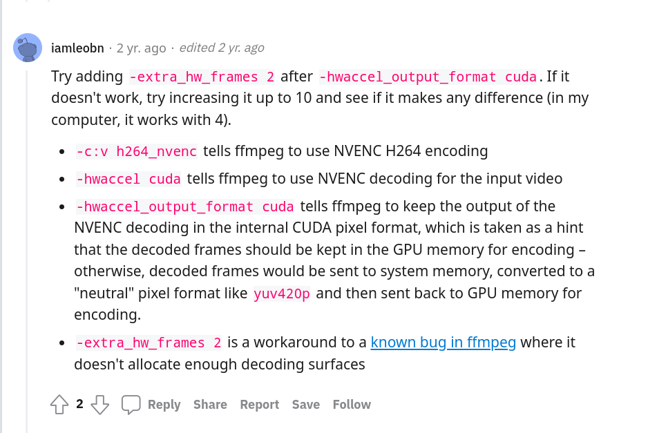

# 硬件编解码调试记录

## 驱动安装
参考noition笔记

安装驱动后，重新通过apt-get 安装ffmpeg，然后通过ffmpeg -hwaccels查看是否有cuda的硬件加速，如果有则安装成功。  
查询支持的编解码器可通过以下指令
    
```bash
ffmpeg -codecs | grep nvenc
```

## 硬件解码调试

使用FFMEPG进行解码测试：
```bash
ffmpeg -y -vsync 0 -hwaccel cuda -hwaccel_output_format cuda -i input.mp4 -c:a copy -c:v h264_nvenc -b:v 5M output.mp4
```

实际发现有点问题，报错，解决方法参照[reddit老哥的说法](https://www.reddit.com/r/ffmpeg/comments/oxwskj/unable_to_make_cuda_ffmpeg_work/)，进行修改，[老哥的说法参照](https://trac.ffmpeg.org/ticket/7562)



```bash
ffmpeg -y -vsync 0 -hwaccel cuda -hwaccel_output_format cuda -extra_hw_frames 2 -i input.mp4 -c:a copy -c:v h264_nvenc -b:v 5M output.mp4
```


调试参考代码及教程：[CUDA硬解并使用Qt播放](https://feater.top/ffmpeg/ffmpeg-video-by-cuda-display-by-qt-in-yuv420sp)

硬件解码测试demo：[硬解测试demo](../../CETC_ProgOnCar/H264Decode2RGB/src/H264_Decoder_HW.cc) 

硬件编码直接修改编码器即可

```cpp
AVCodec *codec = avcodec_find_encoder_by_name("h264_nvenc");
```

## 工程文件

修改后的工程文件目录为：/home/shawntao/WorkSpace/CETC_ProgOnCar/CETC_H264_Transformer_Terminal/UGV_Relay